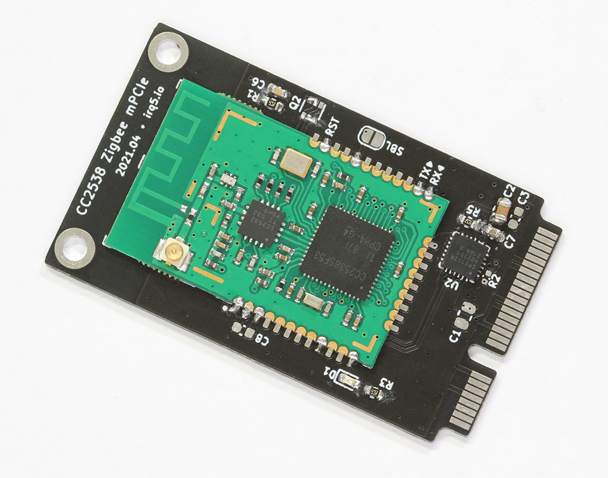

CC2538 Zigbee mPCIe Adapter
============================

For use with [zigbee2mqtt](https://www.zigbee2mqtt.io/).

This card is basically a USB-to-serial adapter for the CC2538 + CC2592 PA Zigbee module.
It is intended for use in host devices that accept mPCIe cards, instead of having a Zigbee dongle sticking out of the USB port.
The antenna connection is also brought out to an external SMA connector via a U.FL pigtail.

As with most of my boards, this was designed to be flexible. The TX and RX pins from the module are clearly marked, so that the card can be repurposed as a generic serial device mPCIe card.
There are also various test points for I²C, as well as control for the WLAN/WWAN LEDs that are on the host machine.

This project is authored in [KiCad EDA](https://www.kicad.org/).
You can find schematics and the BOM under the [Releases](https://github.com/geekman/zigbee-mpcie-card/releases) section.

Assembly Instructions
======================

Please be aware that there are a few variations of this CC2538 module with different pinouts and dimensions.
The one I bought, and used in this mPCIe card, is available on [AliExpress here](https://www.aliexpress.com/item/4000748032872.html).
Also note that the presence of an on-board antenna; the module needs to be physically configured to use the U.FL connector instead of the on-board antenna.
You will need to indicate this to the seller, or you can modify it yourself by moving a capacitor (or resistor, not sure what that part is).

The card has support for native USB connectivity to the CC2538, but it is not used. 
As such, the component on the back side should not be populated, as well as R2 on the front side. The BOM file has these parts marked as DNP.

Additionally, Q2 was added for an ESP8266-style auto reset, but since the `cc2538-bsl` does not support this style of bootloader invocation, the pins of Q2 need to be manually bridged. The new revision of PCB has these connections marked out on the silkscreen.

Testing
--------

When inserted, the card should be detected as a CP2102N USB device on the host.

You need the [cc2538-bsl](https://github.com/JelmerT/cc2538-bsl) Python tool, 
which only depends on `pyserial`.
Note that the tool will try to reconnect to the port with an increased baud rate for faster transfer speeds, but this was causing problems for me. Use `-b` to set a fixed baud rate, and choose a lower value for stability.

You can test that the mPCIe card is properly detected by reading from the CC2538 with `-r`:

```
$ python3 cc2538-bsl.py -b 500000 -r test.bin
Opening port /dev/ttyUSB0, baud 500000
Connecting to target...
CC2538 PG2.0: 512KB Flash, 32KB SRAM, CCFG at 0x0027FFD4
Primary IEEE Address: 00:12:4B:00:19:4A:F1:CE
Reading 524288 bytes starting at address 0x200000
 0x200xxx: 0xffffffff
```

If you do specify the `-V` verbose flag, you see that chip ID for the CC2538 has been correctly detected:

```
$ python3 cc2538-bsl.py -V -r test.bin
Opening port /dev/ttyUSB0, baud 500000
Connecting to target...
*** sending synch sequence
Got 0 additional bytes before ACK/NACK
*** GetChipId command (0x28)
Got 0 additional bytes before ACK/NACK
*** received 6 bytes
*** GetStatus command (0x23)
Got 0 additional bytes before ACK/NACK
*** received 3 bytes
Command Successful
    Version 0x0000B964
    Target id 0xb964, CC2538
  .
  .
  .
```


Firmware Flashing
==================

You can download a zigbee2mqtt-compatible firmware here:

- <https://github.com/jethome-ru/zigbee-firmware/tree/master/ti/coordinator/cc2538_cc2592>

Here are some other firmware for reference:

- <https://github.com/egony/MODKAM-STICK-V3/tree/master/firmware/cc2538/Riverieline_2020-02>
- <https://github.com/Koenkk/Z-Stack-firmware/tree/master/coordinator>

You can choose either one; I went with the JetHome one.

Use the `cc2538-bsl.py` tool with `-w -v` to write and verify the firmware file.
Both the `.bin` and `.hex` contain the same firmware, just in a different format.

```
$ python3 cc2538-bsl.py -b 115200 -w -v JH_2538_2592_ZNP_UART_20201010.bin
Opening port /dev/ttyUSB0, baud 115200
Reading data from JH_2538_2592_ZNP_UART_20201010.bin
Cannot auto-detect firmware filetype: Assuming .bin
Connecting to target...
CC2538 PG2.0: 512KB Flash, 32KB SRAM, CCFG at 0x0027FFD4
Primary IEEE Address: 00:12:4B:00:19:4A:F1:CE
Writing 524256 bytes starting at address 0x00200000
Write 232 bytes at 0x0027FEF88
    Write done
Verifying by comparing CRC32 calculations.
    Verified (match: 0x6273805e)
```

You should now see the power LED on the mPCIe card light up.

Bootloader "Backdoor"
----------------------

Note that while the serial bootloader is a convenient way to program the CC2538, it may also be disabled by the firmware developer for security reasons.

The firmware images provided above all have this "bootloader backdoor" enabled, so that newer firmware can be flashed via the serial port.
This is done by setting some bits in the Customer Configuration Area (CCA) to enable the backdoor, and allowing for activation via pin `PA7`.
For more information, see the SWRA466 document here: <https://www.ti.com/lit/pdf/swra466>

You can verify this by opening the firmware HEX file and seeing the value `0xF7` set at `0x0027.FFD7`. (Actually the write begins at `0x27FFD4` to write a 32-bit value `FF FF FF F7`)

If you do not flash these bytes into the CCA, the serial bootloader can no longer be accessed and you will need JTAG to program the device. The connector has been brought out to the back side of the card, in case this is needed.


License
========
  
**cc2538-mpcie-card is licensed under the TAPR Open Hardware License (https://www.tapr.org/OHL).**

Copyright (C) 2021 Darell Tan

The TAPR Open Hardware License ("OHL") agreement provides a legal
framework for Open Hardware projects.
The OHL addresses unique issues involved in the creation of tangible,
physical things, but does not cover software, firmware, or code loaded
into programmable devices.

